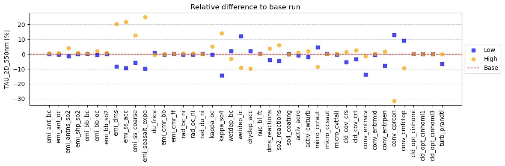

# Multi-Model PPE Experiment

## Organizers
- Hailing Jia ([h.jia@sron.nl](mailto:h.jia@sron.nl))
- ...

## Deadlines for Submission of Model Data
- **[One-At-a-Time Test](#one-at-a-time-test):** 31 July 2026
- **[PPE Experiments](#ppe-simulations):** 31 August 2026

## Motivation
To understand and constrain the uncertainty in aerosol radiative forcing (ACI+ARI) in different model systems, a Multi-Model Perturbed Parameter Ensemble (MMPPE) involving different aerosol- and cloud-related parameters is needed. With this, we will be able to jointly tackle two dominant sources of model uncertainty: structural uncertainty and parametric uncertainty. The AeroCom MMPPE experiment is also linked to the CMIP7 Aerosol-Cloud Interactions Perturbed Parameter Ensemble Model Intercomparison Project ([ACI-PPEMIP](https://wcrp-cmip.org/mips/)).

## Objectives
- Quantify parametric uncertainty across different models and assess the relative contributions of parametric versus structural uncertainties.
- Constrain parametric uncertainty using new observations from 2025, (e.g., EarthCARE and PACE).
- Identify structural deficiencies in models and guide improvements to parameterizations.

## Proposed Model Experiments

### General Simulation Requirements
- **Simulation Period:** 1850 for Preindustrial (PI) and 2025 for present-day (PD).
- **Spin-up:** 1-year control run (spin-up)  + 3-month PPE run (spin-up) + 1-year PPE run (final results)

- **Nudging:** Both PI and PD winds (not temperature or relative humidity) are nudged towards reanalysis data. Nudging to ERA5 with a relaxation timescale of ~6 hours above the boundary layer (~2 km) is recommended. Other reanalyses or nudging configurations (e.g.,throughout the atmospheric column or difference relaxation time) are also acceptable.

- **CFMIP COSP:** Optional, but highly desirable for models with COSP

- **Ensemble size:** The number of simulations should be at least 6 times the number of [perturbed parameters](#perturbed-parameters), with a target ratio of 8 where possible. For example, a PPE with 25 parameters would require a minimum of 25 × 6 × 2 (PI+PD) = 300 simulations.

- **Input/Forcing datasets** (kept as consistent as possible with CMIP7):

    - **Anthropogenic emission:** CEDS v2025-04-18 (available for 1850-2023; 2022-2023 repeated for 2024-2025)
    - **Biomass burning emission:** GFED5.1 (daily) for PD; CMIP7 biomass burning (monthly) for PI
    - **GHGs and ozone:** CMIP7 ScenarioMIP `m` for GHGs, `vl` for ozone (only `vl` and `h` are currently available)
    - **SST/SIC:** Prescribed from ERA5 monthly data for the year 2025 for both PI and PD runs

    >**Note**: All above inputs are available at https://public.spider.surfsara.nl/project/polder/hjia/MMPPE_input. Most datasets are provided at fine spatial resolution (e.g., 0.25° × 0.25°) to be regridded to match your model resolution.

### PPE Experiments

| Experiment | Emissions | Nudging | SST & SIC | Other forcing |
|------------|-----------|---------|---------|---------------|
| PI         | 1850      | 2025    | 2025     |2025| 
| PD         | 2025      | 2025    | 2025     |2025     |      

### One-At-a-Time Test

To ensure that all parameters are wired properly, **a five-day One-At-a-Time (OAT) test (1–5 Aug 2026) is strongly recommended before the PPE runs.** In each simulation, one parameter is set to its lower or upper bound while all others remain at their default values.

**Variables to test:**
- AOD, AE, SSA, AAOD
- CCN at 0.3% SS (column and surface)
- In-cloud CDNC at cloud top, cloud cover, LWP, IWP
- Surface precipitation flux
- Shortwave and longwave cloud forcing
- Net radiation flux at TOA

For each variable, please report the global-mean absolute and relative changes with respect to the baseline run.

An example of relative change in AOD from ICON-HAM:

### Perturbed Parameters
We focus on multiple aerosol- and cloud-related processes. For aerosols, they are aerosol emissions, optical and hygroscopic properties, wet and dry depositions, nucleation,  aging and chemistry, with a special focus on emissions from biomass burning and natural sources. For clouds, the targeted processes/schemes include activation, cloud microphysics, cloud cover, convection, optical processes, and turbulence. See [Jia et al. (2026)](acp_link) for more detials.

**Latin hypercube sampling** strategy is used to generate parameter values for each ensemble member. An example Python script can be found at: https://github.com/hljia/LHS_example

Parameters labeled "Rel" are scaling factors relative to the control values, whereas those labeled "Abs" are absolute values. 

>**Note**: If the default parameter value in your model differs substantially from the protocol value (e.g., lies close to or outside the prescribed range), please scale the parameter range proportionally to preserve the same min/default and max/default ratios.

#### Mandatory (21)
These parameters are not model-dependent, so all models should be able to perturb them. 

| Variable   | Default | Range  | Description | Process | Remark | 
|------------|---------|--------|-------------|---------|--------|
| emi_ant_so2 (Rel)| 1       |[0.6, 2]| Scale factor for anthropogenic so2 emissions | Emission | |
| emi_ant_bc (Rel)| 1 |[0.6, 2] | Scale factor for anthropogenic bc emission | Emission | |
| emi_ant_oc (Rel)| 1 | [0.6, 2] | Scale factor for anthropogenic oc emission | Emission | |
| emi_bb_so2 (Rel)| 1 |[0.25, 4] | Scale factor for biomass burning so2 emission | Emission | |
| emi_bb_bc (Rel)| 1 | [0.25, 4] | Scale factor for biomass burning bc emission | Emission |
| emi_bb_oc (Rel)| 1 | [0.25, 4] | Scale factor for biomass burning oc emission | Emission | | 
| emi_dms (Rel)| 1 | [0.2, 3] | Scale factor for DMS emission | Emission | |
| emi_ss_acc (Rel)| 1 | [0.1, 3] | Scale factor for accumulation mode sea salt emission | Emission | | 
| emi_ss_coa (Rel)| 1 | [0.1, 3] | Scale factor for coarse mode sea salt emission | Emission | |
| emi_du (Rel)| 1 | [0.5, 2] | Scale factor for dust emission | Emission | |
| emi_cmr_ff (Abs)| 30nm | [15, 45] | Emitted particle size for fossil fuel emissions (unit: nm) | Emission | not in NorESM |
| emi_cmr_bb (Abs)| 75nm | [25, 250] | Emitted particle size for biomass burning emissions | Emission | not in NorESM |
| rad_bc_ni (Abs)| 0.71 | [0.2, 0.9] | BC imaginary refractive index |Aerosol Optics | |
| rad_oc_ni (Abs)|0.0055 | [0.0001,0.05] | OC imaginary refractive index | Aerosol Optics | too wide; max: 0.1 -> 0.05|
| wetdep_ic (Rel)| 1 | [0.75, 1.25] | Scale factor for in-cloud wet deposition rate | Deposition | |
| activ_aero (Rel)| 1 | [0.75, 1.25] | Scale factor for activated aerosols | Activation | reflects the uncertainty of activation scheme; [0.75, 1.25] from [Ghosh et al. (2025)](https://doi.org/10.5194/gmd-18-4899-2025) |
| activ_cwturb (Rel)| 1 | [0.3,3] | Scale factor for vertical velocity for activation | Activation | Very uncertain according to [Virtanen et al. (2025)](https://www.nature.com/articles/s41561-025-01662-y)|
| micro_ccraut (Rel)| 2.8 | [0.9,15] | Scale factor for autoconversion rate from cloud droplets to rain in stratiform clouds | Microphysics | | 
| micro_ccsaut (Rel)| 1200 | [100, 2000] | Scale factor for autoconversion rate from cloud ice to snow | Microphysics | |
| conv_cprcon (Abs)| 1e-4 s-1| [5e-5,8e-4] | Conversion rate from cloud water to rain in convective clouds | Convection | |
| conv_entrpen (Abs)| 3e-4 m-1| [2e-5,4e-4] | Entrainment rate for deep convection | Convection | |

#### Recommended (8)
These parameters are either less critical than mandatory parameters or important but absent in some models.

| Variable   | Default | Range  | Description | Process | Remark | 
|------------|---------|--------|-------------|---------|--------|
| micro_ccraut_cdnc_expo (Abs) | -1.79 | [-0.8,-2] | CDNC exponent in autoconversion scheme | Microphysics | **Highly recommanded** if Khairoutdinov and Kogan (2010) scheme is used| 
| micro_ccraut_lwp_expo (Abs) | 2.47 | [2.1,3.3] | LWP exponent in autoconversion scheme| Microphysics | **Highly recommanded** if Khairoutdinov and Kogan (2010) scheme is used| 
| drydep_acc (Rel)| 1 | [0.1,10] | Scale factor for dry deposition rate of accumulation-mode aerosols | Deposition | | 
| chem_so2 (Rel) | 1 | [0.5, 2] | Scale factor for so2 chemistry reaction rates | Chemistry | |
| kappa_so4  (Abs)| 0.6 | [0.3,0.8] | Hygroscopic parameter for sulfate aerosols | Hygroscopicity | |
| coating_so4 (Abs)| 1 | [0.3,5] | Layer thickness of sulfate to transfer an insoluble particle to a soluble mode | Aging | It is  given in units of layers of monomolecular sulfate, NOT ‘nm’ |
| emi_ss_expo (Rel)| 1 | [0.9,1.1] | Scale factor for wind exponent in the parameterization  of sea salt emission | Emission | |
| conv_cmfctop (Abs)| 0.1 | [0.01,0.35] | fractional convective mass flux across the top of cloud | Convection | |

#### Optional

| Variable   | Default | Range  | Description | Process | Remark | 
|------------|---------|--------|-------------|---------|--------|
| rad_du_ni (Abs)| 1e-3 | [2e-4,1e-2] | Dust imaginary refractive index | Aerosol Optics | |
| wetdep_bc (Rel)| 1 | [0.3,3] | Scale factor for below-cloud wet deposition rate | Deposition | |
| kappa_oc (Abs)| 0.06 | [0.02,0.4] | Hygroscopic parameter for oc aerosols | Hygroscopicity | |
| nucl_bl_ft (Rel)| 1 | [0.01,10] | Scale factor for nucleation rate in BL and FT | Nucleation | |
| chem_dms (Rel)| 1 | [0.5,2] | Scale factor for dms chemistry reaction rates | Chemistry | |
| micro_icefall (Rel)| 1| [0.4,2] | Scale factor for terminal fall velocity of cloud ice crystals| Microphysics | |
| cld_cov_crs (Abs)| 0.968 | [0.9,0.98] | critical relative humidity at surface | Cloud cover | |
| cld_cov_crt (Abs)| 0.8 | [0.7,0.85] | critical relative humidity aloft | Cloud cover | |
| conv_entrscv (Abs)| 3e-3 m-1| [2e-4,4e-3] | entrainment rate for shallow convection | Convection | |
| conv_entrmid (Abs)| 2e-4 m-1| [2e-5,4e-4] | entrainment rate for mid-level convection | Convection | |
| cld_opt_cinhomi (Abs) | 0.7 | [0.6,1] | Inhomogeneity factor for ice clouds | Cloud Optocs | |
| cld_opt_cinhoml1 (Abs)| 0.8 | [0.6,1] | Inhomogeneity factor for stratiform clouds | Cloud Optics | |
| cld_opt_cinhoml3 (Abs) | 0.8 | [0.6,1] | Inhomogeneity factor for deep/mid-level convection | Cloud Optics | |
| turb_prandtl (Abs) | 1 | [0.6,1] | Neutral limit Prandtl number | Turbulence | |

## Model Output Variables

### 6-hourly Instantaneous

| **Variable Name**         | **Variable Name**                     | **Unit** | **Remark**             |
|---------------------------|---------------------------------------|----------|------------------------|
| **3D (lev, lat, lon)**    |                                       |          |                        |
| aerosol_extinction_355nm              | aerosol_extinction@355nm         | m-1 | Model output need to be interpolated to the specified altitudes (m) during post-processing. 8 levels; *lev*= [0, 200, 500, 1000, 2000, 3500, 6000, 10000] m|
| **2D (lat, lon)**         |                                       |          |                        |
| TAU_2D_550nm              | Aerosol Optical thickness @550nm      | 1 |                        |
| ABS_2D_550nm              | Absorption optical thickness @550nm   | 1 |                        |
| ANG_440nm_670nm           | Angstroem parameter 440nm-670nm       | 1 |                        |
| TAU_2D_MODE_KS_550nm      | Optical thickness by mode KS 550nm    | 1 |   reduce to 3 variables: Fine, Coarse_soluble and Coarse_insoluble                     |
| TAU_2D_MODE_AS_550nm      | Optical thickness by mode AS 550nm    | 1 |                        |
| TAU_2D_MODE_CS_550nm      | Optical thickness by mode CS 550nm    | 1 |                        |
| TAU_2D_MODE_KI_550nm      | Optical thickness by mode KI 550nm    | 1 |                        |
| TAU_2D_MODE_AI_550nm      | Optical thickness by mode AI 550nm    | 1 |                        |
| TAU_2D_MODE_CI_550nm      | Optical thickness by mode CI 550nm    | 1 |                        |
| burden_bc                 | Atmospheric burden of BC              | kg m-2   |                        |
| burden_du                 | Atmospheric burden of DU              | kg m-2   |                        |
| burden_oc                 | Atmospheric burden of OC              | kg m-2   |                        |
| burden_so4                | Atmospheric burden of SO4             | kg m-2   |                        |
| burden_ss                 | Atmospheric burden of SS              | kg m-2   |                        |
| burden_wat                | Atmospheric burden of WAT             | kg m-2   |                        |
| burden_icnc               | Atmospheric burden of ICNC            | m-2   |                        |
| burden_cdnc               | Atmospheric burden of CDNC            | m-2   |                        |
| CN_BURDEN                 | Condensation Nuclei number Burden (>200nm in diameter)     | m-2      | Radius > 1.0E-7 m      | 
| **N70**                | Number concentration of aerosol particles (>70 nm in diameter) @surface | m-3      | Radius > ?m; align with surface obs. #TBD Dan/Harri|     
| **N100**                | Number concentration of aerosol particles (>100 nm in diameter) @surface | m-3      | Radius > ?m; align with surface obs. #TBD Dan/Harri|       
| CCN_BURDEN_0.100          | Cloud Condensation Nuclei burden at S=0.1% | m-2   |                        |
| CCN_BURDEN_0.300          | Cloud Condensation Nuclei burden at S=0.3% | m-2   |                        |
| CCN_BL1_0.100             | Cloud Condensation Nuclei at 1km above surface at S=0.1% | m-3 |                        |
| CCN_BL1_0.300             | Cloud Condensation Nuclei at 1km above surface at S=0.3% | m-3 |                        |
| CCNS_0.100                | Cloud Condensation Nuclei at surface at S=0.1% |m-3 |#TBD more levels and SS may be added                      |
| CCNS_0.300                | Cloud Condensation Nuclei at surface at S=0.3% |m-3 |                        |
| SO4                       | Surface SO4 mass concentration         | kg m-3  |                        |
| SO4_bl                    | SO4 mass concentration at 1km above ground |kg m-3  |                        |
| ND_INCL_CT                | cloud top in-cloud cloud droplet number conc. | m-3 |                        |
| CDR_CT                    | cloud top effective radius    | $\mu$m       |            
| ICR_CT                    | cloud-top_ice_crystal_effective_radius | $\mu$m       |                   |
| clt                       | total cloud cover                      | m2 m-2  |                        |
| lcc                       | liquid cloud cover                     | m2 m-2  |                        |
| icc                       | ice cloud cover                        | m2 m-2  |                        |
| cod                       | cloud_optical_depth                    | 1|                        |
| codliq                    | cloud_optical_depth_due_to_liquid      | 1|                        |
| codice                    | cloud_optical_depth_due_to_ice         | 1|                        |
| cllvi                     | vertically integrated cloud water      | kg m-2  |                        |
| clivi                     | vertically integrated cloud ice        | kg m-2  |                        |
| pr                        | precipitation flux                     | kg m-2 s-1 |                        |
| PM1                       | Surface PM1 mass concentration         | kg m-3  |                        |
| PM2.5                     | Surface PM2.5 mass concentration       | kg m-3  |                        |
| PM10                      | Surface PM10 mass concentration        | kg m-3  |                        |
| BC                        | Surface BC mass concentration          | kg m-3  |                        |
| rsdt         | toa incident shortwave radiation | W m-2 | |
| rsut         | toa outgoing shortwave radiation | W m-2 | |
| rsutcs       | toa outgoing clear-sky shortwave radiation  | W m-2 | |
| rlut         | toa outgoing longwave radiation  | W m-2 | |
| rlutcs       | toa outgoing clear-sky longwave radiation  | W m-2 | |
| rsut_na      | toa outgoing shortwave radiation (aerosol-free)  | W m-2 | Double-call to radiation is needed for aerosl-free diagnostics|
| rsutcs_na    | toa outgoing clear-sky shortwave radiation (aerosol-free)  | W m-2 | |
| rlut_na      | toa outgoing longwave radiation (aerosol-free)  | W m-2 | |
| rlutcs_na    | toa outgoing clear-sky longwave radiation (aerosol-free)  | W m-2 | |
| LTS          | lower tropospheric stability | K | |
| wbase        | updraft velocity at cloud base for activation | m s-1 | |
| CTH          | liquid cloud top altitude | m | |
| CBH          | liquid cloud base altitude | m | |

>**Note**: For the Fortran code used to diagnose cloud-top properties by phase, see the *"Cloud-top calculation"* section of the [aci-baseline](../aci-baseline/aci-baseline.md) experiment documentation.

### 6-hourly Instantaneous (optional)

| **Variable Name**         | **Variable Name**                     | **Unit** | **Remark**             |
|---------------------------|---------------------------------------|----------|------------------------|
| **2D (lat, lon)**    |                                       |          |                        |
| modis_cloud_fraction_total | modis_Cloud_Fraction_Total | % | |
| modis_cloud_fraction_water |  modis_Cloud_Fraction_Water | % | |
| modis_cloud_fraction_ice | modis_Cloud_Fraction_Ice | % | |
| modis_cloud_fraction_low | modis_Cloud_Fraction_Low | % | |
| modis_cloud_fraction_mid | modis_Cloud_Fraction_Mid | % | |
| modis_cloud_fraction_high | modis_Cloud_Fraction_High | % | |
| modis_optical_thickness_total | modis_Optical_Thickness_Total | 1 | |
| modis_optical_thickness_water | modis_Optical_Thickness_Water | 1 | |
| modis_optical_thickness_ice | modis_Optical_Thickness_Ice | 1 | |
| modis_cloud_particle_size_water | modis_Cloud_Particle_Size_Water | $\mu$m | |
| modis_cloud_particle_size_ice | modis_Cloud_Particle_Size_Ice | $\mu$m | |
| modis_liquid_water_path | modis_Liquid_Water_Path | kg m-2 | |
| modis_ice_water_path | modis_Ice_Water_Path | kg m-2 | |
| prw          | vertically integrated water vapour | kg m-2 | |
| hfls         | latent heat flux | W m-2 | |
| hfss         | sensible heat flux | W m-2 | |
| hdtcbl       | height of PBL top | m | |
| CTT          | warm (T>268K) cloud top temperature | K | |
| uas          | zonal wind in 10m | m s-1 | |
| vas          | meridional wind in 10m | m s-1 | #TBD from Ed, some high-freq could be output only in CTRL run? |

### Monthly Mean
| **Variable Name**         | **Variable Name**                     | **Unit** | **Remark**             |
|---------------------------|---------------------------------------|----------|------------------------|
| **All 6h outputs** |  |  | **Output all 6h disgnostics except for cosp** |
| ... | ... | ... | Variable list see [6-hourly instantaneous](#6-hourly-instantaneous) and [6-hourly instantaneous (optional)](#6-hourly-instantaneous-optional) |
| **3D (lev, lat, lon)**    |                                       |          |                        |
| **zg**         | geometric height at full level_center | m | constant over time |
| **dzhalf**     | layer thickness of model levels | m | constant over time |
| hur            | relative_humidity | % | | 
| hus            | specific_humidity | kg kg-1 | |
| cl             | cloud area fraction | m2 m-2 | |
| cli            | specific cloud ice content | kg kg-1 | |
| clw            | specific cloud water content | kg kg-1 | |
| wap            | varical velocity | Pa s-1 | |
| ta             | air temperature | K | |
| rho            | air_desity | kg m-3 | |
| pfull          | air pressure | Pa | |
| CCN_0.100      | Cloud Condensation Nuclei at S=0.100% | m-3 | |
| CCN_0.300      | Cloud Condensation Nuclei at S=0.300% | m-3 | |
| DMS            | DMS mass mixing ratio | kg kg-1 | |
| SO2            | SO2 mass mixing ratio | kg kg-1 | |
| SO4            | SO4 mass mixing ratio | kg kg-1 | |
| BC             | BC mass mixing ratio | kg kg-1 | |
| OC             | OC mass mixing ratio | kg kg-1 | |
| DU             | dust mass mixing ratio | kg kg-1 | |
| SS             | seasalt mass mixing ratio | kg kg-1 | |
| WAT            | aerosol water mass mixing ratio | kg kg-1 | |
| CDNC           | cloud droplet number mixing ratio | kg-1 | |
| ICNC           | Ice crystal number mixing ratio | kg-1 | |
| **2D (lat, lon)**    |                                       |          |                        |
| lsm                 | land-sea mask | 1 | |
| rsdt                 | toa incident shortwave radiation | W m-2 | |
| rsut                 | toa outgoing shortwave radiation | W m-2 | |
| rsutcs               | toa outgoing clear-sky shortwave radiation | W m-2 | |
| rlut                 | toa outgoing longwave radiation | W m-2 | |
| rlutcs               | toa outgoing clear-sky longwave radiation | W m-2 | |
| rsut_na              | toa outgoing shortwave radiation (aerosol-free) | W m-2 | |
| rsutcs_na            | toa outgoing clear-sky shortwave radiation (aerosol-free) | W m-2 | |
| rlut_na              | toa outgoing longwave radiation (aerosol-free) | W m-2 | |
| rlutcs_na            | toa outgoing clear-sky longwave radiation (aerosol-free) | W m-2 | |
| albedo         | surface albedo | 1 | |
| ptp            | tropopause air pressure | Pa | |
| ps             | surface air pressure | Pa | |
| psl            | mean sea level pressure | Pa | |
| dew2           | dew point temperature in 2m | K | |
| prcr           | convective precipitation flux (water) | kg m-2 s-1 | | 
| prcs           | convective precipitation flux (snow) | kg m-2 s-1 | | 
| prlr           | large-scale precipitation flux (water) | kg m-2 s-1 | | 
| prls           | large-scale precipitation flux (snow) | kg m-2 s-1 | | 
| ts             | surface temperature | K | |
| tas            | temperature in 2m | K | |
| burden_dms     | atmospheric burden of DMS | kg m-2 | |
| burden_so2     | atmospheric burden of SO2 | kg m-2 | |
| burden_bc      | atmospheric burden of BC | kg m-2 | |
| burden_du      | atmospheric burden of DU | kg m-2 | |
| burden_oc      | atmospheric burden of OC | kg m-2 | |
| burden_so4     | atmospheric burden of SO4 | kg m-2 | |
| burden_ss      | atmospheric burden of SS | kg m-2 | |
| burden_wat     | atmospheric burden of WAT | kg m-2 | |
| CT_TIME        | cloud top occ. time fraction | 1 | for custom stream | 
| emi_dms        | accumulated emission mass flux of DMS | kg m-2 s-1 | |
| emi_so2        | accumulated emission mass flux of SO2 | kg m-2 s-1 | |
| emi_so4        | accumulated emission mass flux of SO4 | kg m-2 s-1 | |
| emi_bc         | accumulated emission mass flux of BC | kg m-2 s-1 | |
| emi_oc         | accumulated emission mass flux of OC | kg m-2 s-1 | |
| emi_du         | accumulated emission mass flux of dust | kg m-2 s-1 | |
| emi_ss         | accumulated emission mass flux of seasalt | kg m-2 s-1 | |
| emi_bb_so2     | accumulated emission mass flux of SO2 due to fire | kg m-2 s-1 | |
| emi_bb_bc      | accumulated emission mass flux of BC due to fire | kg m-2 s-1 | |
| emi_bb_oc      | accumulated emission mass flux of OC due to fire | kg m-2 s-1 | |
| ANG_550nm_865nm      | Angstroem parameter 550nm-865nm | 1 | |
| ABS_COMP_BC_550nm    | Absorption optical thickness BC @550nm | 1 | |
| ABS_COMP_OC_550nm    | Absorption optical thickness OC @550nm | 1 | |
| ABS_COMP_SO4_550nm   | Absorption optical thickness SO4 @550nm | 1 | |
| ABS_COMP_DU_550nm    | Absorption optical thickness dust @550nm | 1 | |
| ABS_COMP_SS_550nm    | Absorption optical thickness seasalt @550nm | 1 | |
| ABS_COMP_WAT_550nm   | Absorption optical thickness water @550nm | 1 | |
| TAU_COMP_BC_550nm    | Optical thickness BC @550nm | 1 | |
| TAU_COMP_OC_550nm    | Optical thickness OC @550nm | 1 | |
| TAU_COMP_SO4_550nm   | Optical thickness SO4 @550nm | 1 | |
| TAU_COMP_DU_550nm    | Optical thickness dust @550nm | 1 | |
| TAU_COMP_SS_550nm    | Optical thickness seasalt @550nm | 1 | |
| TAU_COMP_WAT_550nm   | Optical thickness water @550nm | 1 | |
| TAU_2D_MODE_KS_550nm | Optical thickness soluble Aitken mode @550nm | 1 | |
| TAU_2D_MODE_AS_550nm | Optical thickness soluble accumulation mode @550nm | 1 | |
| TAU_2D_MODE_CS_550nm | Optical thickness soluble coarse mode @550nm | 1 | |
| TAU_2D_MODE_KI_550nm | Optical thickness insoluble Aitken mode @550nm | 1 | |
| TAU_2D_MODE_AI_550nm | Optical thickness insoluble accumulation mode @550nm | 1 | | 
| TAU_2D_MODE_CI_550nm | Optical thickness insoluble coarse mode @550nm | 1 | |
| ABS_2D_MODE_KS_550nm | Absorption optical thickness soluble Aitken mode @550nm | 1 | |
| ABS_2D_MODE_AS_550nm | Absorption optical thickness soluble accumulation mode @550nm | 1 | |
| ABS_2D_MODE_CS_550nm | Absorption optical thickness soluble coarse mode @550nm | 1 | |
| ABS_2D_MODE_KI_550nm | Absorption optical thickness insoluble Aitken mode @550nm | 1 | |
| ABS_2D_MODE_AI_550nm | Absorption optical thickness insoluble accumulation mode @550nm | 1 | |
| ABS_2D_MODE_CI_550nm | Absorption optical thickness insoluble coarse mode @550nm | 1 | |

## Model Output Submission

For **One-At-a-Time Test**, upload your OAT plots to the google drive folder  [ACI-PPEMIP_OAT/](https://drive.google.com/drive/folders/1V1c-4pqVWfcsTqqsZ4UamWCuBw-jrNvz?usp=drive_link) (please create a folder for your model), and enter your parameter ranges in the spreadsheet [ACI-PPEMIP parameter ranges](https://docs.google.com/spreadsheets/d/1tHGisfeP_58EO69tO5mt5H-nEfxcTZLcGYEDKeKs-v0/edit?gid=0#gid=0). The ICON-HAM results are provided there as an example (create a model folder by yourself).

For **PPE experiments**, submit the following data via the AeroCom website ([Submit Data](https://aerocom.met.no/FAQ/data_access/submit_data)):

- A text file listing the ensemble IDs and corresponding parameter values, i.e., `PPE_values_<ModelName>.txt` generated by [Latin Hypercube Sampling (LHS) code](https://github.com/hljia/LHS_example). Ensemble ID `exp_0` represents the control run.

- Required outputs from the control run + all LHS-generated ensemble members.

### Model Output Naming Convention
The format for the AeroCom file name (one variable per file) should be:

`aerocom4_<ModelName>_<YOUR_EXPERIMENT_NAME>-<SimulationName>_<VariableName>_<VerticalCoordinateType>_<Year>_monthly.nc`

#### Example Filenames
- **2-D:** `aerocom4_ICON-HAM_<YOUR_EXPERIMENT_NAME>-PD_aod_Surface_2025_monthly.nc`
- **3-D:** `aerocom4_ICON-HAM_<YOUR_EXPERIMENT_NAME>-PD_aod_ModelLevel_2025_monthly.nc`
- **3-D (reduced levels):** `aerocom4_ICON-HAM_<YOUR_EXPERIMENT_NAME>-PD_aerext_CustomLevel_2025_monthly.nc` (only for aerosol extinction)
## References
Ghosh, P., Evans, K. J., Grosvenor, D. P. et al. Assessing modifications to the Abdul-Razzak and Ghan aerosol activation parameterization (version ARG2000) to improve simulated aerosol–cloud radiative effects in the UK Met Office Unified Model (UM version 13.0). Geosci. Model Dev. 18, 4899–4913 (2025). https://doi.org/10.5194/gmd-18-4899-2025

Jia, H., Neubauer, D., Bhatti, Y. et al. Parametric uncertainty in aerosol effective radiative forcing in the global aerosol–climate model ICON2.6.4–A–HAM2.3. EGUsphere [preprint] (2026). 

Virtanen, A., Joutsensaari, J., Kokkola, H. et al. High sensitivity of cloud formation to aerosol changes. Nat. Geosci. 18, 289–295 (2025). https://doi.org/10.1038/s41561-025-01662-y

